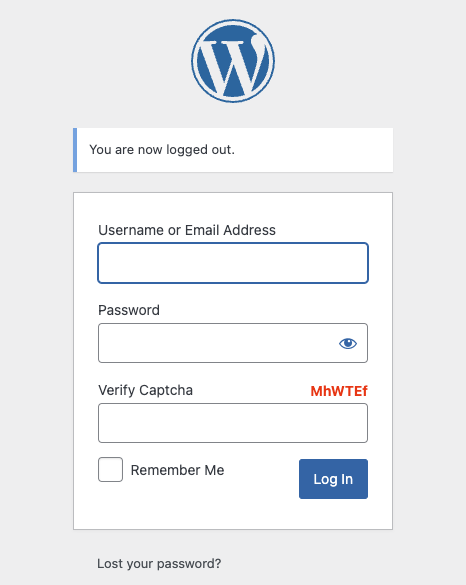
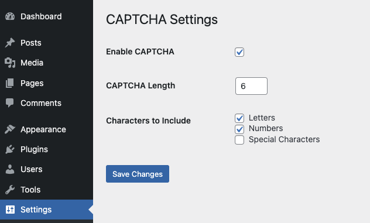

# CAPTCHA for WordPress Login

## Description

CAPTCHA for WordPress Login is a simple yet customizable plugin that adds a CAPTCHA to the WordPress login page. This plugin helps protect your site from automated login attempts by requiring users to solve a CAPTCHA challenge before logging in.

## Features

- **Customizable CAPTCHA Length**: You can set the length of the CAPTCHA string, ranging from 4 to 10 characters.
- **Character Type Selection**: Choose the types of characters to include in the CAPTCHA, such as letters, numbers, and special characters.
- **Enable/Disable CAPTCHA**: Easily enable or disable the CAPTCHA feature via the settings page.
- **SPL Autoloading**: Uses SPL autoloading to load classes, keeping the codebase organized and efficient.

## Installation
1. Upload the plugin files to the `/wp-content/plugins/captcha/` directory.
2. Activate the plugin through the 'Plugins' screen in WordPress.
3. Navigate to **Settings > CAPTCHA Settings** to configure the plugin.

## Usage
1. **Enable CAPTCHA**: Check the "Enable CAPTCHA" option to activate the CAPTCHA on your login page.
2. **Set CAPTCHA Length**: Choose a length between 4 and 10 characters for the CAPTCHA.
3. **Select Character Types**: Choose whether to include letters, numbers, and/or special characters in the CAPTCHA.
4. Save your settings.

## Development
- **Languages**: PHP
- **WordPress Version**: Tested up to 6.6.1
- **Requires PHP**: 8.1.29 or higher

## License
This plugin is licensed under the GPL v2 or later.
